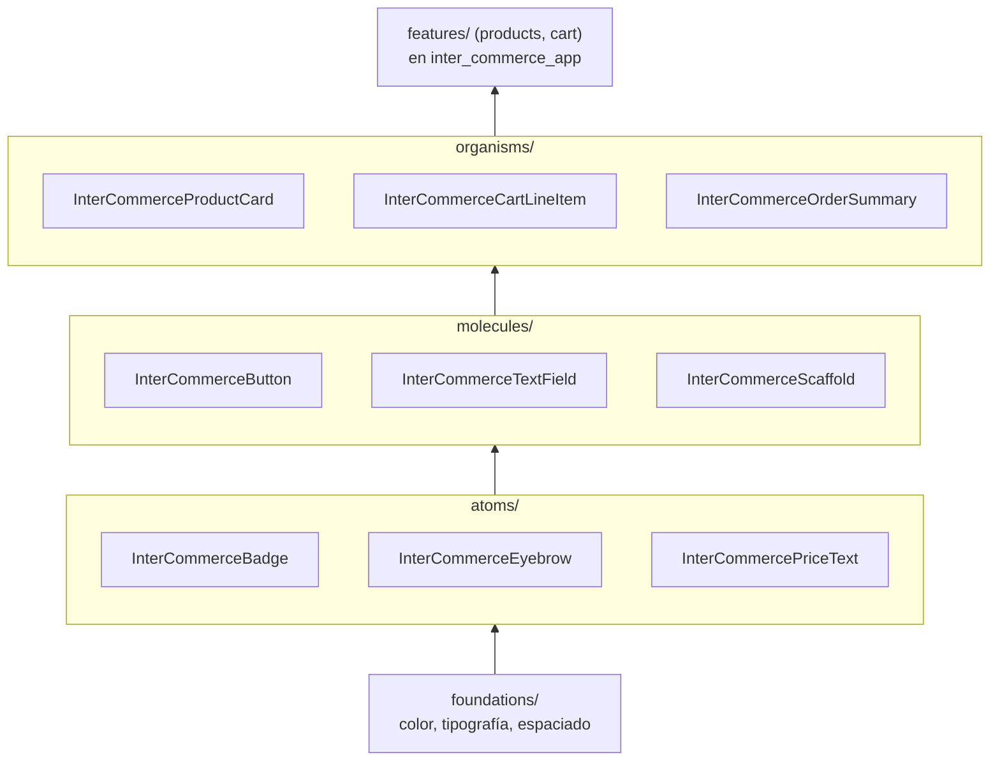

# Inter Commerce App — Design System

Paquete Flutter independiente que concentra los tokens de diseño (color, tipografía, espaciado), el tema (`InterCommerceTheme`) y los componentes visuales que consume la capa de presentación de [`inter_commerce_app`](https://github.com/cgarzon1/inter_commerce_app). Se implementó como paquete separado, en vez de como una carpeta de widgets dentro de la app, para que la definición visual del producto no quede atada a la estructura interna de una aplicación puntual.

La idea detrás de un sistema de diseño en un proyecto de software es esa: en lugar de que cada pantalla resuelva por su cuenta cómo se ve un botón, una tarjeta de producto o un espaciado, existe un único lugar donde esas decisiones se definen una vez y se consumen desde ahí. Si el tema cambia, cambia en un solo punto y se propaga a todo lo que lo consume, en vez de tener que replicarse pantalla por pantalla.

Este paquete sigue Atomic Design para organizar esa jerarquía: los tokens (`foundations/`) alimentan los átomos, los átomos se combinan en moléculas, y las moléculas en organismos — cada nivel construido únicamente a partir del nivel anterior, nunca al revés.

